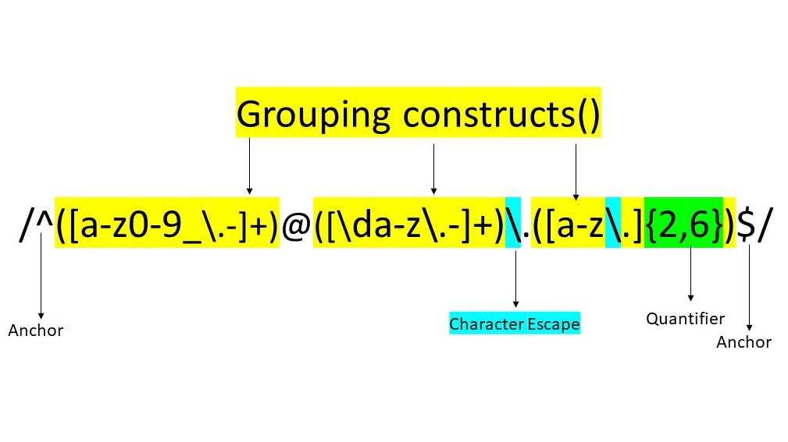

# Matching an email pattern in Regex

The term "Regex" stands for "Regular expressions" which are strings defining a pattern. They are used in different programming languages: JavaScript, PHP, Python, Perl and Java.
In JavaScript, RegEx are objects which are defined in Literals or Classes.

## Summary

In this tutorial would discuss: RegEx for Email.

>/^([a-z0-9_\.-]+)@([\da-z\.-]+)\.([a-z\.]{2,6})$/

## Table of Contents

- [Anchors](#anchors)
- [Quantifiers](#quantifiers)
- [Grouping Constructs](#grouping-constructs)
- [Bracket Expressions](#bracket-expressions)
- [Character Classes](#character-classes)
- [The OR Operator](#the-or-operator)
- [Flags](#flags)
- [Character Escapes](#character-escapes)

## Regex Components

Regex Components include Anchors, Quantifiers, Grouping constructs, character classes, character escapes, flags, OR operator. 

The email Regex includes following Components:

### Anchors ^ or $

*Preceed the string defining the character pattern
*For Email RegEx, we have ^ (Circumflex) anchor in the begining and $ at the end. 

### Grouping Constructs ()

used for complex Regex, where the pattern has to be matched in different sections.

### Bracket Expressions []

define range of characters to be matched

### Quantifiers {}

define the minimum and maximum number of times the defined pattern can be matched.

### Character Classes

### Flags

### Character Escapes

## Author

A short section about the author with a link to the author's GitHub profile (replace with your information and a link to your profile)
